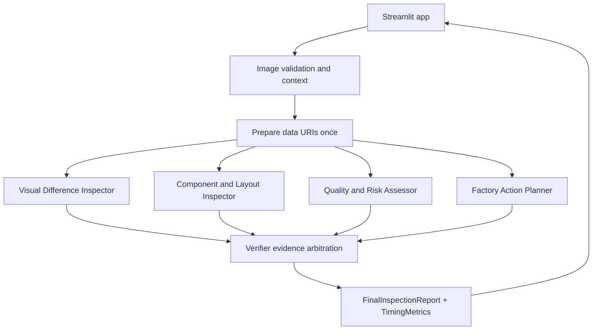

# FactorySwarm

FactorySwarm is a Streamlit-based multimodal, multi-agent manufacturing inspection MVP powered by Gemma 4 31B on Cerebras. It compares a known-good golden-reference image with an inspected product image, optional corresponding ROI crops, optional factory context, and optional dataset annotation metadata.

The product claim: Cerebras makes consulting multiple specialist visual-inspection agents fast enough for an interactive industrial workflow.

FactorySwarm is decision support only. Human verification is required, and visual inspection cannot establish electrical functionality.

## Architecture



## Agents

- Visual Difference Inspector: visible differences, locations, extent, and possible imaging artifacts.
- Component and Layout Inspector: missing, misplaced, rotated, damaged, discolored, or inconsistent visible elements.
- Quality and Risk Assessor: pass, manual_review, rework, or reject using only visual evidence.
- Factory Action Planner: practical containment and follow-up actions with responsible roles.
- Verifier: combines valid specialist reports, tolerates failed agents, removes unsupported claims, and produces one structured decision.

## Setup

```bash
conda activate factoryswarm
python --version
python -m pip install -r requirements.txt
```

Create `.env` from `.env.example`:

```bash
CEREBRAS_API_KEY=
CEREBRAS_MODEL=gemma-4-31b
```

Do not commit `.env`.

## Run

```bash
conda run -n factoryswarm streamlit run app.py
```

FactorySwarm opens in **Operator Mode** by default. Use the small sidebar interface selector to switch to **Expert Mode** when you need the full development and debugging interface.

Use **Load Sample Case** for `sample_cases/reference.jpg` and `sample_cases/inspection.jpg`; the sample config also defines corresponding central-IC ROI crops used as local visual evidence. You may upload JPEG/PNG full images and optional paired ROI crops. Optional annotation masks are not sent to agents and are only shown after **Reveal Dataset Annotation**.

## Visual System

FactorySwarm uses a shared dark scientific command-center design system across both modes. Theme tokens live in `ui/theme.py` and `.streamlit/config.toml`; reusable rendering helpers keep custom HTML centralized and escape dynamic model/user text before rendering.

Design principles:

- Very dark navy application chrome with elevated panels and thin blue-gray borders.
- Neon teal/cyan accents for active pipeline state, with amber/orange/red decision colors.
- Sans-serif text for workflow UI and monospace text for telemetry, timing, model, and console labels.
- Real timing metrics only; estimated values are labeled as estimates.
- Accessible status text and icons in addition to color.
- Progressive disclosure in Operator Mode and higher information density in Expert Mode.

## Operator Mode

Operator Mode is optimized for high-throughput QA work. The inspected product image is the primary visual inside a dark evidence viewer, the golden reference stays loaded for batch use, and the command panel emphasizes the decision, confidence, human-review requirement, top warnings, and next action.

- Operator Mode automatically loads the first PCB4 dataset image and starts one inspection for that selected image.
- **Previous PCB Image** and **Next PCB Image** change the selected PCB image, clear image-specific results, and automatically run the inspection once for the new selection.
- Session-state guards prevent Streamlit reruns from repeatedly calling the API for the same selected image.
- Reference, ROI comparison, annotation reveal, detailed findings, specialist reports, and system timing remain available in collapsed dark sections.
- Keyboard shortcuts are documented as a workstation workflow target, but this Streamlit MVP keeps reliable button-first operation.

## Expert Mode

Expert Mode is the dense command-center workspace for demos, development, and troubleshooting. It continues to expose full input controls, side-by-side full images, optional ROI crops, mask reveal, specialist reports, verifier consensus, policy notes, and timing metrics. Inputs are grouped in the sidebar, while the main workspace shows pipeline telemetry, evidence tabs, agent orchestration, an activity console, and final consensus details.

## Dark-Theme Accessibility

- Decision states include text and symbols, not color alone.
- Body text uses high-contrast navy/white/cyan combinations rather than low-contrast gray.
- Buttons keep large click targets and visible labels.
- Motion is restrained and respects reduced-motion preferences through CSS.
- The layout is designed to wrap on common laptop widths without horizontal page scrolling.

## Recommended Factory Workflow

1. Open Operator Mode and let the first PCB sample load and inspect automatically.
2. Use **Previous PCB Image** and **Next PCB Image** to move through the PCB4 queue.
3. Wait for the automatic inspection to complete for each selected image.
4. Act on PASS, MANUAL REVIEW, REWORK, or REJECT.
5. Open collapsed details only when warnings or partial agent failures require it.
6. Switch to Expert Mode when full evidence controls or report details are needed.

## Tests

Ordinary tests are offline:

```bash
conda run -n factoryswarm python -m pytest -q
conda run -n factoryswarm python -m compileall .
```

Optional live Cerebras smoke tests:

```bash
RUN_LIVE_API_TESTS=1 conda run -n factoryswarm python -m pytest -q -m integration tests/smoke_test.py tests/multimodal_smoke_test.py tests/pair_smoke_test.py
```

Manual OpenCV difference smoke:

```bash
conda run -n factoryswarm python tests/difference_smoke_test.py
```

## Structured Output

Prompts request concise JSON. The Cerebras SDK is called through `core/cerebras_client.py` with JSON-schema response format when enabled. Every specialist report and final report is validated with Pydantic. Malformed JSON gets one repair attempt; repeated failure becomes a structured agent failure.

## Grounding Safeguards

FactorySwarm labels every multimodal image explicitly. With ROI crops, Image 1 and Image 2 remain the complete reference and inspection images, while Image 3 and Image 4 are corresponding local crops. A deterministic verifier policy layer then filters unsupported claims, caps confidence for ambiguous evidence, records policy notes, and prevents repeated unsupported claims from becoming confirmed observations by majority vote.

## Failure Handling

- Missing API key, corrupt images, unsupported MIME types, and oversized uploads produce safe user-facing errors.
- Specialist calls run concurrently; one failed specialist does not crash the workflow.
- The verifier receives valid reports plus a failure summary.
- Verifier failure falls back to a validated manual-review report.
- Timing metrics include per-agent latency, parallel wall-clock latency, verifier latency, total workflow latency, estimated sequential specialist latency, and calculated speedup.
- Unsupported BOM, counterfeit, electrical-failure, internal-damage, root-cause, and ambiguous package/component claims are preserved under removed unsupported claims instead of silently discarded.

## Why Cerebras Speed Matters

Traditional single-agent inspection forces one model response to cover every role. FactorySwarm asks four specialists to inspect the same evidence concurrently, then asks a verifier to arbitrate. Cerebras latency makes that multi-agent consultation plausible inside a demo-friendly inspection loop.

## Limitations

- Results are not a replacement for professional inspection.
- Electrical, thermal, internal, chemical, and mechanical function cannot be established visually.
- Lighting, focus, alignment, viewpoint, scale, and compression can create false visual differences.
- OpenCV difference overlays are visual aids, not ground truth.
- Dataset masks are evaluation metadata, not model evidence by default.
- ROI crops are inspection aids and not proof of a defect by themselves.
- The MVP does not control factory equipment or approve unsafe operation.

## Security

The API key is read only from environment variables or `.env`, never displayed by the app, and never included in prompts. Uploaded images are decoded as images and are not executed.

## VisA Dataset Attribution

This repository includes VisA-style dataset assets under `data/` with `data/LICENSE-DATASET` containing the Creative Commons Attribution 4.0 International license. Preserve attribution when using dataset images or masks in demos or derived materials.

## 60-Second Demo Flow

1. Start Streamlit and let Operator Mode load the first PCB sample automatically.
2. Show that the inspection image is prominent and the reference is collapsed.
3. Point out the automatic four-agent inspection and compact specialist status rows.
4. Review the decision, confidence, top warnings, and next action.
5. Open **System details** to highlight estimated sequential latency versus parallel latency.
6. Switch to **Expert Mode** to show the full report, ROI evidence, policy notes, and optional annotation reveal.
