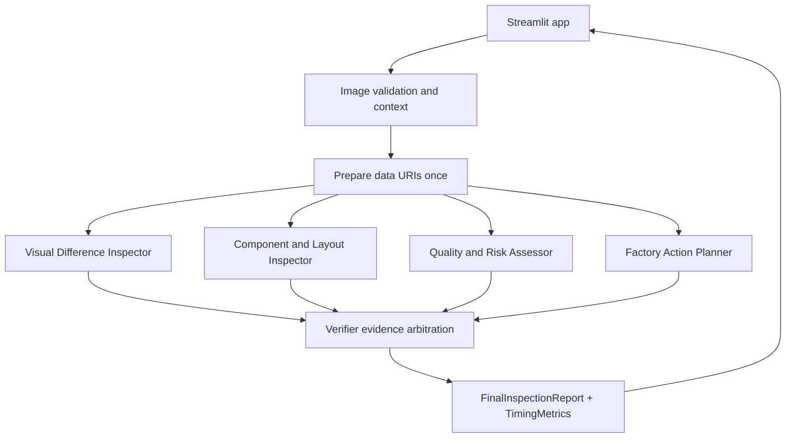

# FactorySwarm

FactorySwarm is a Streamlit-based multimodal, multi-agent manufacturing inspection MVP powered by Gemma 4 31B on Cerebras. It compares a known-good golden-reference image with an inspected product image, optional factory context, and optional dataset annotation metadata.

The product claim: Cerebras makes consulting multiple specialist visual-inspection agents fast enough for an interactive industrial workflow.

FactorySwarm is decision support only. Human verification is required, and visual inspection cannot establish electrical functionality.

## Architecture



## Agents

- Visual Difference Inspector: visible differences, locations, extent, and possible imaging artifacts.
- Component and Layout Inspector: missing, misplaced, rotated, damaged, discolored, or inconsistent visible elements.
- Quality and Risk Assessor: pass, manual_review, rework, or reject using only visual evidence.
- Factory Action Planner: practical containment and follow-up actions with responsible roles.
- Verifier: combines valid specialist reports, tolerates failed agents, removes unsupported claims, and produces one structured decision.

## Setup

```bash
conda activate factoryswarm
python --version
python -m pip install -r requirements.txt
```

Create `.env` from `.env.example`:

```bash
CEREBRAS_API_KEY=
CEREBRAS_MODEL=gemma-4-31b
```

Do not commit `.env`.

## Run

```bash
conda run -n factoryswarm streamlit run app.py
```

Use **Load Sample Case** for `sample_cases/reference.jpg` and `sample_cases/inspection.jpg`, or upload JPEG/PNG images. Optional annotation masks are not sent to agents and are only shown after **Reveal Dataset Annotation**.

## Tests

Ordinary tests are offline:

```bash
conda run -n factoryswarm python -m pytest -q
conda run -n factoryswarm python -m compileall .
```

Optional live Cerebras smoke tests:

```bash
RUN_LIVE_API_TESTS=1 conda run -n factoryswarm python -m pytest -q -m integration tests/smoke_test.py tests/multimodal_smoke_test.py tests/pair_smoke_test.py
```

Manual OpenCV difference smoke:

```bash
conda run -n factoryswarm python tests/difference_smoke_test.py
```

## Structured Output

Prompts request concise JSON. The Cerebras SDK is called through `core/cerebras_client.py` with JSON-schema response format when enabled. Every specialist report and final report is validated with Pydantic. Malformed JSON gets one repair attempt; repeated failure becomes a structured agent failure.

## Failure Handling

- Missing API key, corrupt images, unsupported MIME types, and oversized uploads produce safe user-facing errors.
- Specialist calls run concurrently; one failed specialist does not crash the workflow.
- The verifier receives valid reports plus a failure summary.
- Verifier failure falls back to a validated manual-review report.
- Timing metrics include per-agent latency, parallel wall-clock latency, verifier latency, total workflow latency, estimated sequential specialist latency, and calculated speedup.

## Why Cerebras Speed Matters

Traditional single-agent inspection forces one model response to cover every role. FactorySwarm asks four specialists to inspect the same evidence concurrently, then asks a verifier to arbitrate. Cerebras latency makes that multi-agent consultation plausible inside a demo-friendly inspection loop.

## Limitations

- Results are not a replacement for professional inspection.
- Electrical, thermal, internal, chemical, and mechanical function cannot be established visually.
- Lighting, focus, alignment, viewpoint, scale, and compression can create false visual differences.
- OpenCV difference overlays are visual aids, not ground truth.
- Dataset masks are evaluation metadata, not model evidence by default.
- The MVP does not control factory equipment or approve unsafe operation.

## Security

The API key is read only from environment variables or `.env`, never displayed by the app, and never included in prompts. Uploaded images are decoded as images and are not executed.

## VisA Dataset Attribution

This repository includes VisA-style dataset assets under `data/` with `data/LICENSE-DATASET` containing the Creative Commons Attribution 4.0 International license. Preserve attribution when using dataset images or masks in demos or derived materials.

## 60-Second Demo Flow

1. Start Streamlit and click **Load Sample Case**.
2. Show the golden reference and inspection image side by side.
3. Click **Run Inspection** and point out the four concurrent specialist agents.
4. Review the final decision, confidence, observations, hypotheses, and actions.
5. Open performance metrics and highlight estimated sequential latency versus parallel latency.
6. Upload or reveal a mask only after explaining it is evaluation metadata, not model input.
